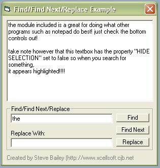



## Find/Find Next/Replace Example

### Description

shows how to put Find/Find Next and Replace functions for the textbox control in your applications. reduces all the hassle down to simple 1 line function calls. please vote :P
 
### More Info
 

             |
---                |---
**Submitted On**   |2003-10-26 15:36:02
**By**             |[Aimee Bailey](https://github.com/Planet-Source-Code/PSCIndex/blob/master/ByAuthor/aimee-bailey.md)
**Level**          |Intermediate
**User Rating**    |5.0 (20 globes from 4 users)
**Compatibility**  |VB 6\.0
**Category**       |[VB function enhancement](https://github.com/Planet-Source-Code/PSCIndex/blob/master/ByCategory/vb-function-enhancement__1-25.md)
**World**          |[Visual Basic](https://github.com/Planet-Source-Code/PSCIndex/blob/master/ByWorld/visual-basic.md)
**Archive File**   |[Find\_Find\_16634610262003\.zip](https://github.com/Planet-Source-Code/aimee-bailey-find-find-next-replace-example__1-49461/archive/master.zip)

